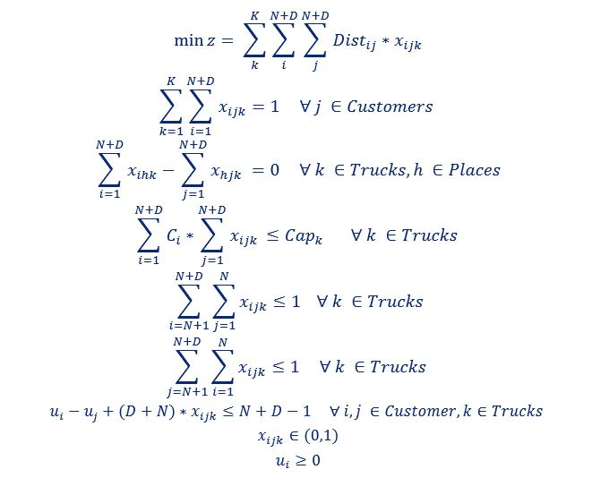

# Vehicle Routing Problem

This is a VRP with the objective to reduce total accumulated Waiting time. 
The problem is modeled with the pulp solver and also tried to solved with Simulated Annealing.
You can also change the buildin pulp solver to CPLEX/GUROBI etc. if you have the license for it and it is configured
with pulp.
The mathematical formulation is the following:

